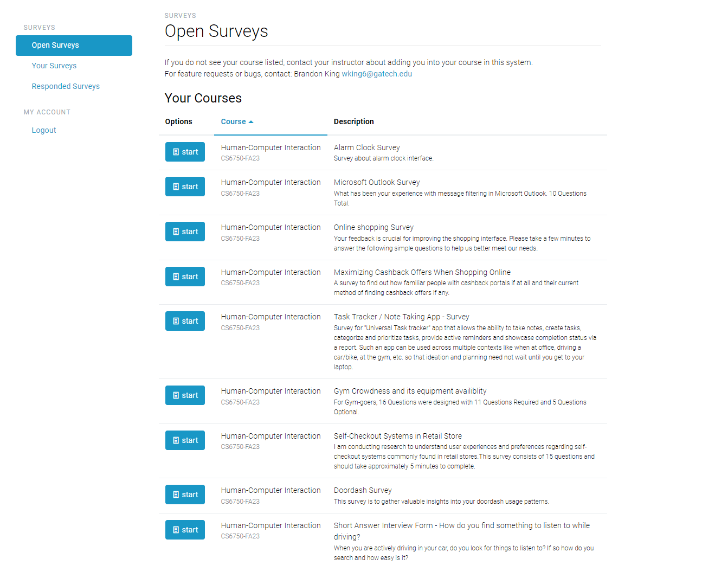

# Survey Difficulty Organizer Chrome Extension

## Overview

The Survey Difficulty Organizer Chrome Extension is a handy tool that displays the difficulty of surveys available on the gatech peersurvey website. It works by fetching data from the API endpoint and counting the number of required questions and type in each survey in the list of open surveys. The "open surveys" page is then sorted easiest to hardest, or you can think of this as length of time required to complete the survey lowest time required to highest. This information is then locally cached for speed.

### Without Extension



### With Extension


## Table of Contents

- [Getting Started](#getting-started)
- [How It Works](#how-it-works)
- [License](#license)
- [Contributing](#contributing)
- [Acknowledgments](#acknowledgments)

## Getting Started

To use the PeerSurveyExtension Chrome Extension, follow these steps:

1. Clone the repository to your local machine:

   ```bash
   git clone https://github.com/zfoltz/PeerSurveyExtension.git
2. Open Google Chrome and navigate to chrome://extensions/.

3. Enable "Developer mode" in the top right corner of the extensions page.

4. Click on the "Load unpacked" button and select the extension directory (survey-counter-extension) from your local machine.

5. The extension icon Extension Icon should now appear in your Chrome toolbar.

6. Navigate to the webpage where surveys are available, and it will automatically sort the surveys.

## How It Works
The extension works by:

1. Waiting until you navigate to peersurvey.gatech.edu.

2. Grabing the cookies from the peersurvey website.

3. Making an API request to get a list of the open surveys.

4. Making an API request to get the survey question data for each open survey.
   
6. Scoring the difficulty or time to complete of each survey

7. Sorting the main page "dashboard" from easiest to hardest and showing the calculated difficulty.

Please note that the extension is designed to work with a specific API endpoint (e.g., http://peersurvey.cc.gatech.edu/api/v1/dashboard), so it will not work on other websites without modifications.

## License
This project is licensed under the MIT License - see the LICENSE file for details.

## Contributing
Contributions are welcome! Here are some ways you can contribute to the project:

- Report bugs or issues by creating a new issue.

- Submit feature requests or suggestions via issues.

- Fork the repository, make changes, and create a pull request to contribute code.

- Please read our Contributing Guidelines for more details on how to contribute to this project.

## Acknowledgments
The Survey Counter Chrome Extension was inspired by the need to count surveys on webpages easily.

Special thanks to the Chrome Extension developer community for their valuable insights and resources.
